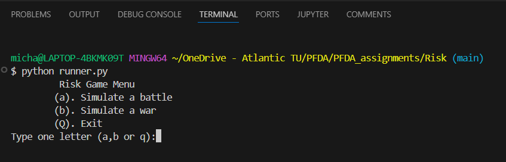
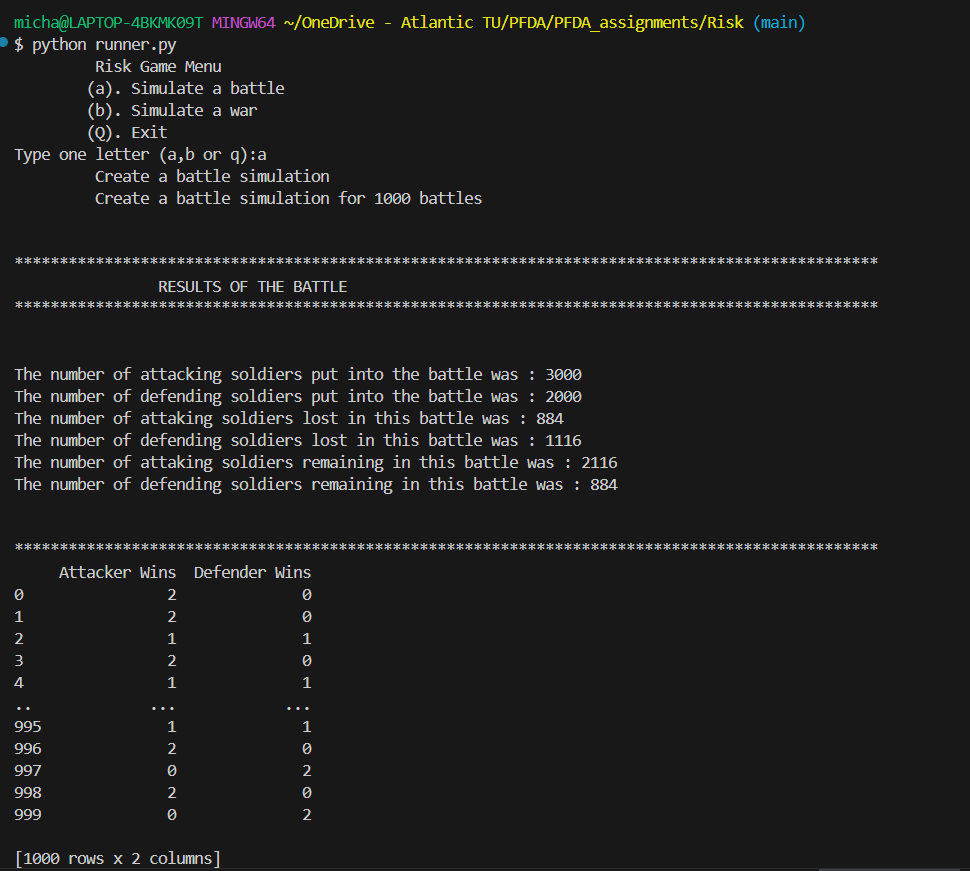
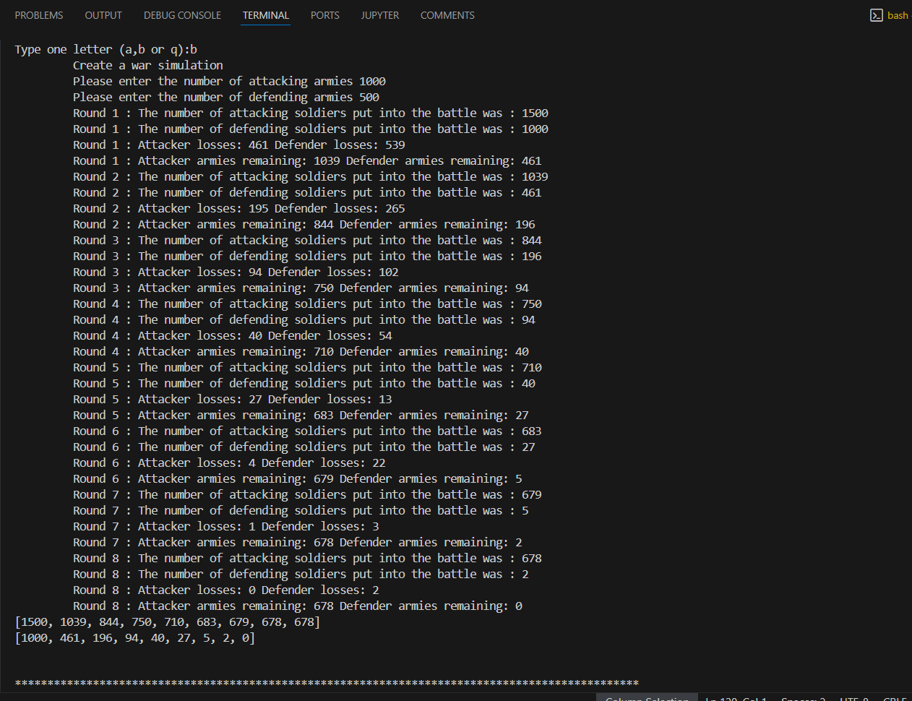

# Risk

## **by Michael Curley**


<div>
<a target="_blank" href="https://docs.python.org/3/tutorial/index.html">
   </a>
<a target="_blank" href="https://www.anaconda.com/">
  
</a>
<a target="_blank" href="https://numpy.org/devdocs/index.html">
  
</a>
<a target="_blank" href="https://pypi.org/project/pandas/">
  
</a>
<a target="_blank" href="https://matplotlib.org/">
  
</a>
<a target="_blank" href="https://docs.github.com/en/get-started/writing-on-github/getting-started-with-writing-and-formatting-on-github/
basic-writing-and-formatting-syntax">
  
</a>
<a target="_blank" href="https://www.latex-project.org/">
  
</a>
<a target="_blank" href="https://code.visualstudio.com/">
  
</a>
<a target="_blank" href="https://jupyter.org/">
  
</a>
</div>

-----

_This README has being written with [GitHub's Documentation on README's](https://docs.github.com/en/repositories/managing-your-repositorys-settings-and-features/customizing-your-repository/about-readmes) in mind. You should refer to that 
documentation for more information on writing an appropriate README for visitors to your 
repository._

_You can find out more about writing in MarkDown in [GitHub Documentation](https://docs.github.com/en/get-started/writing-on-github/getting-started-with-writing-and-formatting-on-github/basic-writing-and-formatting-syntax)_

-----

## Table of Contents.

* [About this project](#10-about-this-project)
* [Use of this project](#20-use-of-this-project)
* [Get Started](#30-get-started)
* [Get Help](#40-get-help)
* [Contribute](#50-contribute)
* [Author](#60-author)

## ***1.0 About this project***

This folder contains a mini project for simulating the game of risk using a variety of Python software modules such as 
[Pandas](https://pandas.pydata.org/), [NumPy](https://numpy.org/) and [Matplotlib](https://matplotlib.org/).


The project should simulates 1000 individual battle rounds in Risk (3 attacker vs 2 defender) and plots the result.
One battle round is one shake of the attacker and defender dice.


A more complicated version simulates a full series of rounds for armies of arbitrary sizes, until one side is wiped out,
and plots the results.


**Rules of Risk**

In each battle round, the attacker can put forward up to three of their troops (This has being assumed to be the maximum number of troops 
that an attacker can put forward). 

The defender can use up to two of their defending troops(again this has being assumed to be the maximum number of troops that a defender 
can put forward).

Each side looses troops depending on the following rules:

1. The two top dice dice are compared (ie the attackers top dice roll with the defenders top dice roll) 
    If the attackers dice is the same or lower they loose one troop otherwise the defender looses a troop (ie if the attackers dice is higher)
2. The next two highest dice from each side are then compared (ie the attackers second highest to the defenders second highest)
    If the attackers dice is the same or lower they loose one troop otherwise the defender looses a troop (ie if the attackers dice is higher)
'''

## 2.0 Use of this Project

This project is being used as a learning tool and in particular a look at Numpy and Random number generation. We look at sorting a array of random number, and how to whittle an array down to the required size. We also explore the Pandas Series which is based on the NumPy array. 

----
## 3.0 Get Started
----

### 3.1 To get stated with this project please follow these steps:

1. Clone the repository to your local machine. 

```sh
git clone https://github.com/MikeCurleyCoosan/PFDA.git

```
2. Download and install [Anaconda](https://www.anaconda.com/). Anaconda comes with its own set of pre-installed data science packages and 
tools, making it convenient for beginners to set up their environment quickly. The pre-installed packages that are required to work with 
the project are [Pandas](https://pandas.pydata.org/), [NumPy](https://numpy.org/) and [Matplotlib](https://matplotlib.org/).

3. Download and install [Visual Studio Code](https://code.visualstudio.com/). Visual Studio Code is a code editor with support for 
development operations like debugging, task running, and version control.

4. Download and install the latest version of [Git](https://git-scm.com/). Git is a free and open source version control system designed 
to handle everything from small to very large projects with speed and efficiency.

5. Navigate to the project directory in VS Code

6. In the terminal window of the project, type 'python runner.py' to run the game.

```sh
python runner.py

```

7. The game then starts and you are given the following options

```sh
python runner.py
        Risk Game Menu
        (a). Simulate a battle
        (b). Simulate a war
        (q). Exit
Type one letter (a,b or q):

```




8. Selecting option a. will simulate 1000 individual battle rounds in Risk (3 attacker vs 2 defender) and plots the result.
One battle round is one shake of the attacker and defender dice. A screenshot of what happens on the console when this option is selected is shown below. The resulting plot is saved to the Plots folder as battle.png.



9. Selecting option b. will simulates a full series of rounds for armies of arbitrary sizes, until one side is wiped out,
and plots the results. The user can select the size of both the attacking and defending army, but in the war scenario, the battles will take place based on the smallest army size put forward. An assumption has being made that each round will simulate 3 attackers vs 2 defenders for each army unit. Again a screenshot of the console when this option is selected is shown below. The resulting plot is saved to the Plots folder as war_simulation.png



10. Seclecting option c. will exit the console gracefully. 

----
## 4.0 Get Help
----

If you encounter any issues or have any questions about this project please [open an issue](https://github.com/MikeCurleyCoosan/PFDA/issues) on GitHub. Alternatively you can contact me at G00376456@atu.ie. 

### 4.1 Issue Tracker

Visit our [issue tracker](https://github.com/MikeCurleyCoosan/PFDA/issues) on GitHub to see if your problem has already been reported or to report a new issue. Feel free to join any ongoing discussions related to bugs or feature requests.

### 4.2 Contact Us

If you need further assistance or have any other inquiries, you can reach out to me via [email](G00376456@gatuie). I will do my best to respond to your enquiry in a timely manner.
Please don't hesitate to reach out if you need help or have feedback on how the project may be improved.

----
## 5.0 Contribute 
----

Contributions from the community to help improve the project are welcome. Whether you're a developer, data scientist, or game enthusiast, there are several ways you can contribute:

### 5.1 Feature Requests

Have an idea for a new feature or enhancement? Feel free to [open a feature request](https://github.com/MikeCurleyCoosan/PFDA/issues) on our GitHub repository. I value your feedback and are always looking for ways to enhance the project.

### 5.2 Code Contributions

If you're interested in contributing code, I would love to have your help! You can [open a pull request](https://github.com/MikeCurleyCoosan/PFDAt/pulls) on our GitHub repository, which I will endevour to respond to in a timely manner.

----
## 6.0 Author
----

### About Me: 

My name is Michael Curley and I am a student in the Higher Diploma in Data Analytics Course in ATU, Galway Ireland. This project was undertaken as part of the Programming for Data Analytics Module undertaken as part of that course of study.

### References


- Reference #1: https://www.ultraboardgames.com/risk/game-rules.php
- Reference #2: https://numpy.org/doc/stable/reference/random/generated/numpy.random.randint.html
